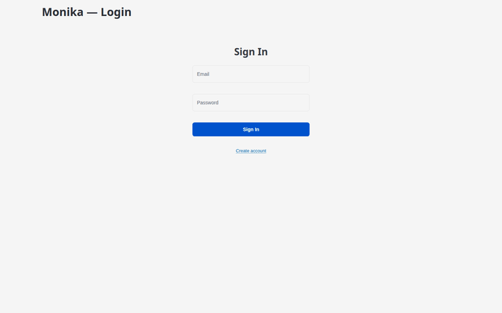

# Monika

**Ashland Hill Media Finance** — AI-powered operating system for film financing: deal management, sales estimates, counterparty credit scoring, production risk, budgeting, scheduling, tax incentives, closing automation, audience intelligence, and talent analysis.



## Features

**Film Financing OS** — 6 modules covering the full deal lifecycle:
- **Deals** — Pipeline dashboard, deal structuring, performance tracking
- **Contacts** — Counterparty profiles with type classification
- **Sales & Collections** — Territory-based MG contracts, collection tracking, variance analysis
- **Credit Rating** — AI-powered counterparty scoring (AAA–CCC tiers)
- **Accounting** — Transaction ledger, multi-currency, net position tracking
- **Communications** — Deal-linked messages and tasks with deadline tracking

**AI Copilot** — Context-aware right-pane assistant on every dashboard page:
- Text-to-SQL queries against the live database
- Module-specific shortcut buttons (e.g. "Total loan exposure", "Overdue collections")
- Automatic context switching between Documents mode (AI Chat) and Copilot mode (dashboards)

**AI Tools** — 7 intelligent modules powered by XAI Grok:
- **Sales Estimates Generator** — Revenue projections benchmarked against TMDB/OMDB comps
- **Production Risk Scoring** — 6-dimension risk analysis with mitigation recommendations
- **Smart Budgeting** — AI-generated low/mid/high budget scenarios
- **Production Scheduling** — Day-by-day schedules with location clustering
- **Soft Funding Discovery** — 16+ global tax incentive programs with rebate calculator
- **Deal Closing & Data Room** — Auto-generated 20-item checklists, document tracking
- **Audience & Marketing Intelligence** — Demographic segmentation, release strategy
- **Talent Intelligence** — TMDB-powered cast search, heat index, package simulation

**AI Chat** — 18 tools accessible via natural language or structured commands:
```
deal:list          portfolio          contact:search NAME
sales:list         credit:CONTACT     transactions       messages
incentives         talent:search NAME
estimate:new       risk:new           budget:new
schedule:new       audience:new       help
```

## Quick Start

```bash
# Clone
git clone https://github.com/predictivelabsai/monika.git
cd monika

# Setup with uv
uv venv
source .venv/bin/activate
uv pip install -r requirements.txt

# Configure
cp .env.sample .env
# Edit .env with your API keys (see below)

# Run database migrations
for f in sql/*.sql; do psql $DB_URL -f "$f"; done

# Seed sample data (14 deals, 21 contacts, 15 comp films from TMDB/OMDB, etc.)
python data/seed_db.py

# Start
python app.py
# Open http://localhost:5010
```

### Alternative: pip

```bash
python -m venv .venv
source .venv/bin/activate
pip install -r requirements.txt
```

### Docker

```bash
docker compose up --build
# Open http://localhost:5010
```

## Environment Variables

Copy `.env.sample` to `.env` and fill in:

| Variable | Description |
|----------|-------------|
| `DB_URL` | PostgreSQL connection string |
| `XAI_API_KEY` | XAI Grok LLM API key |
| `TMDB_API_KEY` | TMDB movie database key |
| `TMDB_API_READ_TOKEN` | TMDB read access token |
| `OMDB_API_KEY` | OMDB movie data key |
| `TAVILY_API_KEY` | Tavily web search key |
| `JWT_SECRET` | Random string for JWT signing |
| `ENCRYPTION_KEY` | Fernet key (generate below) |

```bash
# Generate encryption key
python -c "from cryptography.fernet import Fernet; print(Fernet.generate_key().decode())"
```

## Tech Stack

| Component | Technology |
|-----------|-----------|
| Frontend | FastHTML + HTMX (server-rendered) |
| AI Engine | LangGraph + XAI Grok-3 (18 tools) |
| Database | PostgreSQL (28 tables, `ahmf` schema) |
| Film Data | TMDB + OMDB APIs |
| Auth | Email/password + JWT sessions |
| Deployment | Docker + Coolify |

## Testing

```bash
# Unit + integration tests (30 tests)
python tests/test_suite.py

# Full regression suite — 76 Python + Playwright tests, screenshots to screenshots/
python tests/regression_suite.py --start-app
```

## Screenshots, Video & Docs

All capture scripts assume the app is running on `localhost:5010`. Add `--start-app` where supported to auto-launch it.

```bash
# Regenerate user guide screenshots (17 images → static/guide/)
python tests/capture_guide.py --start-app

# Regenerate demo video + GIF (full Playwright walkthrough → docs/frames/, docs/demo_video.*)
python tests/capture_video.py

# Build video/GIF from existing frames only (no Playwright, no browser needed)
python tests/capture_video.py --video-only

# Capture frames only, skip video/GIF generation
python tests/capture_video.py --capture-only

# Regenerate management slide deck (uses screenshots from static/guide/)
python docs/generate_pptx.py
```

| Script | Output | Description |
|--------|--------|-------------|
| `tests/capture_guide.py` | `static/guide/*.png` | In-app User Guide screenshots |
| `tests/capture_video.py` | `docs/demo_video.gif`, `docs/demo_video.mp4`, `docs/frames/` | Product demo walkthrough (32 frames, ~48s) |
| `docs/generate_pptx.py` | `docs/AHMF_Platform_Overview.pptx` | Management slide deck |

### Changelog

```bash
python change_log.py                  # patch bump
python change_log.py --bump minor     # minor bump
python change_log.py --tag            # also create git tag
```

## Architecture

See [docs/architecture_readme.md](docs/architecture_readme.md) for Mermaid.js diagrams covering system overview, chat message flow, module views, auth, agent tools, database schema, and deployment.

## License

Private & Confidential — Ashland Hill Media Finance
